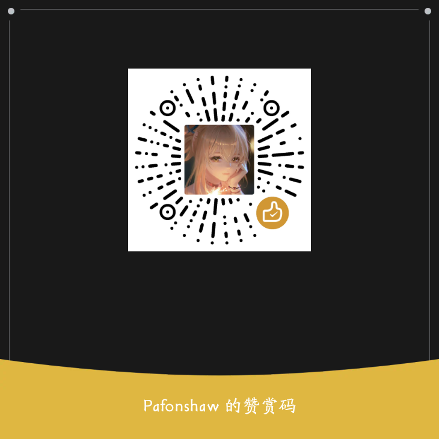

# 注意: 
# 该项目仅用于学习研究, 请遵守百度AI的使用条款和政策。  
# 该脚本仅用于学习交流, 请遵守法律, 禁止用于违法活动.  
# 使用该脚本造成的一切后果与本人无关, 此脚本仅做技术分享  

# BaiDu-AI
逆向自 [百度AI](https://chat.baidu.com/) 接口  
含AI聊天和上传图片功能  
baiduAIv2.py 是脚本本体  
key_js.js 是逆向过程中关键js摘录  

## 功能介绍
- 基于百度AI的接口, 实现了AI聊天和上传图片的功能  

## 使用说明  
- 使用前请先配置cookies  
- 常规模式是集成版, 你可以通过 "帮我对 图片链接 进行 图片识别" 来AI识图, 通过 "帮我画: 图片描述" 来AI绘图  
- 绘画模式可在代码层面传递风格参数  
- 若想直接识别本地图片, 需要使用识图模式来上传图片, 此外它还从代码层面传递识图参数  

## 注意事项  
- 该脚本仅用于学习和研究, 请遵守百度AI的使用条款和政策  
- 该脚本仅用于学习交流, 请遵守法律, 禁止用于违法活动.  
- 使用该脚本造成的一切后果与本人无关, 此脚本仅做技术分享   

## 作者  
- @Pafonshaw
- QQ: 271607916

## 开源协议
- MIT License

## 版本
- v2.0
- 2025/08/01

## 请作者喝杯奶茶  

