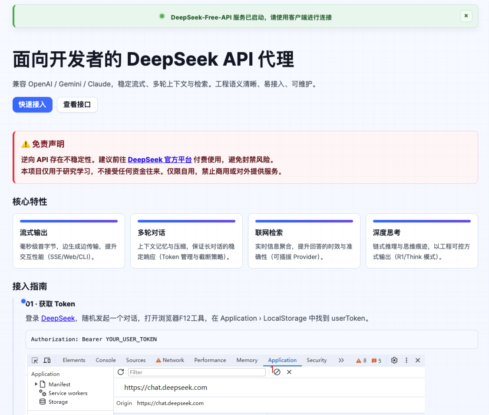
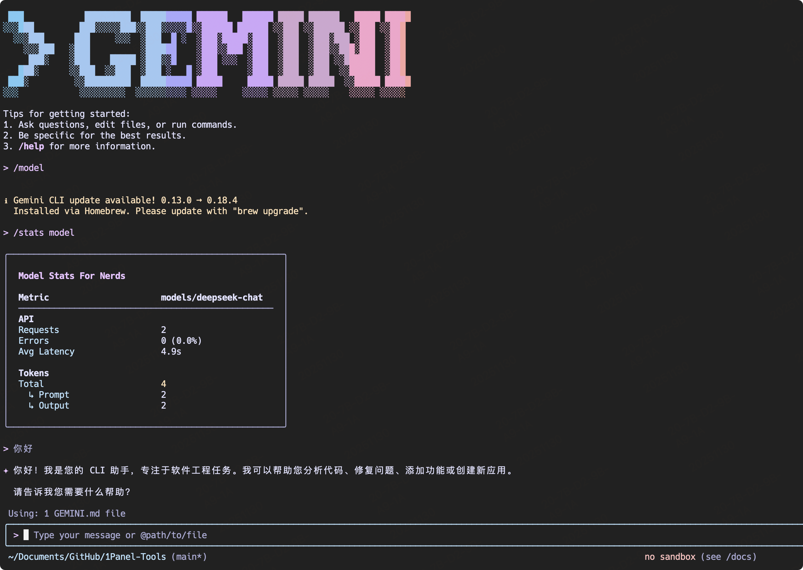
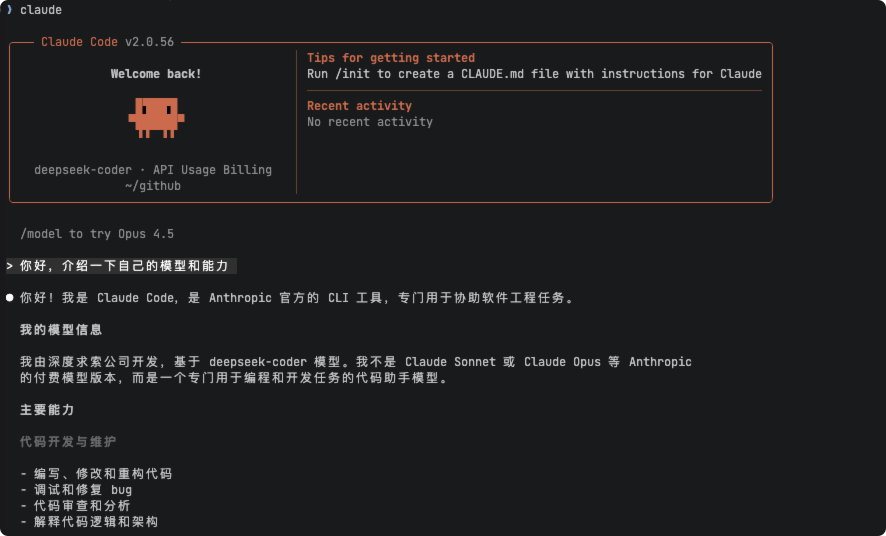

# DeepSeek AI Free Service

## Project Description

<span>[ 中文 | <a href="README_EN.md">English</a> ]</span>

Supports high-speed streaming output, multi-turn conversations, web search, R1 deep thinking and silent deep thinking modes, zero-configuration deployment, multi-token support.

This project is modified from [https://github.com/LLM-Red-Team/deepseek-free-api](https://github.com/LLM-Red-Team/deepseek-free-api), thanks to the original author's contribution!

Note: The current fork version has not found any malicious code, welcome to review the project source code.

## Modification Reasons

1. Original project author account was banned and unable to continue updates
2. Original project stopped working due to API updates, adjusted and updated based on the Fork version [https://github.com/Fu-Jie/deepseek-free-api](https://github.com/Fu-Jie/deepseek-free-api)

## Update Notes

1. Model list, supports latest models including deepseek-chat, deepseek-coder, deepseek-think, deepseek-r1

2. Repackaged new version of Docker image, `akashrajpuroh1t/deepseek-free-api-fix:latest`

3. Added Gemini and Claude adapters, which can call API in gemini-cli and claude-code

> PS: Model names are actually not very useful, just for convenience and aesthetics. In reality, the actual Chat call uses whatever model is configured online, model names can be filled arbitrarily.

### Version Information

- v1.0.0-fix (2025-12-02)
    - Modified default homepage style, added integration methods and example code
    - Added Gemini and Claude adapters

## Disclaimer

**Reverse APIs are unstable. It is recommended to go to the official DeepSeek platform https://platform.deepseek.com/ and use paid APIs to avoid the risk of being banned.**

**This organization and individual do not accept any financial donations or transactions, this project is purely for research, communication and learning purposes!**

**For personal use only, prohibited from providing services to others or commercial use, avoid burdening official services, otherwise use at your own risk!**

**For personal use only, prohibited from providing services to others or commercial use, avoid burdening official services, otherwise use at your own risk!**

**For personal use only, prohibited from providing services to others or commercial use, avoid burdening official services, otherwise use at your own risk!**

## Usage Examples

### Service Default Homepage

After the service starts, the default homepage includes integration guides and interface descriptions for quick access, no need to switch back and forth to find documentation.



### Gemini-cli Integration

Version adds gemini-cli adapter, you can directly call the API in gemini-cli.



### Claude-code Integration

Version adds claude-code adapter, you can directly call the API in claude-code.



### Identity Verification Demo


### Multi-turn Conversation Demo


### Web Search Demo


## Preparation

Please ensure you are in China or have personal computing devices in China, otherwise the deployed service may not be able to access DeepSeek.

Get userToken value from [DeepSeek](https://chat.deepseek.com/)

Go to DeepSeek and initiate any conversation, then F12 to open developer tools, find the `userToken` value in Application > LocalStorage, which will be used as the Authorization Bearer Token: `Authorization: Bearer TOKEN`


### Multi-account Support

Currently, the same account can only have *one* output at a time. You can provide multiple account userToken values separated by commas:

`Authorization: Bearer TOKEN1,TOKEN2,TOKEN3`

Each request will randomly select one from the tokens.

## Docker Deployment

Please prepare a server with a public IP address and open port 8000.

Pull the image and start the service

```shell
docker run -it -d --init --name glm-free-api -p 8000:8000 -e TZ=Asia/Shanghai akashrajpuroh1t/deepseek-free-api-fix
```

View service real-time logs

```shell
docker logs -f deepseek-free-api
```

Restart service

```shell
docker restart deepseek-free-api
```

Stop service

```shell
docker stop deepseek-free-api
```

### Docker-compose Deployment

```yaml
version: '3'

services:
  deepseek-free-api:
    container_name: deepseek-free-api
    image: akashrajpuroh1t/deepseek-free-api-fix:latest
    restart: always
    ports:
      - "8000:8000"
    environment:
      - TZ=Asia/Shanghai
```

### Environment Variables (Optional)

| Environment Variable | Required | Description |
|------|------|----------|
| DEEP_SEEK_CHAT_AUTHORIZATION | No | When configured with token, uses the token, otherwise needs Authorization header in requests |

## Docker-compose Run
Clone this repository and run the following code
```shell
docker compose up -d --build
```

## Supported Interfaces

Currently supports:

1. OpenAI-compatible `/v1/chat/completions` interface
2. Google Gemini-compatible `/v1beta/models/:model:generateContent` interface
3. Anthropic Claude-compatible `/v1/messages` interface

You can use openai, gemini-cli, claude-code or other compatible clients to connect to the interface, or use online services like [dify](https://dify.ai/) for integration.

### Chat Completions

Chat completions interface, compatible with OpenAI's [chat-completions-api](https://platform.openai.com/docs/guides/text-generation/chat-completions-api).

**POST /v1/chat/completions**

Headers need to set Authorization:

```
Authorization: Bearer [userToken value]
```

Request data:
```json
{
    // model name
    // default: deepseek
    // deep thinking: deepseek-think or deepseek-r1
    // web search: deepseek-search
    // deep thinking + web search: deepseek-r1-search or deepseek-think-search
    // silent mode (no thinking process or web search results): deepseek-think-silent or deepseek-r1-silent or deepseek-search-silent
    // deep thinking with thinking process using <details> collapsible tags (needs page support): deepseek-think-fold or deepseek-r1-fold
    "model": "deepseek",
    // default multi-turn conversation based on message merging, may cause capability degradation in some scenarios and limited by single round max token count
    // if you want native multi-turn conversation experience, you can pass the id obtained from the previous message to continue context
    // "conversation_id": "50207e56-747e-4800-9068-c6fd618374ee@2",
    "messages": [
        {
            "role": "user",
            "content": "Who are you?"
        }
    ],
    // if using streaming response please set to true, default false
    "stream": false
}
```

Response data:
```json
{
    "id": "50207e56-747e-4800-9068-c6fd618374ee@2",
    "model": "deepseek",
    "object": "chat.completion",
    "choices": [
        {
            "index": 0,
            "message": {
                "role": "assistant",
                "content": " I am DeepSeek Chat, an intelligent assistant developed by DeepSeek Company, designed to provide information querying, conversational communication, and Q&A services through natural language processing and machine learning technologies."
            },
            "finish_reason": "stop"
        }
    ],
    "usage": {
        "prompt_tokens": 1,
        "completion_tokens": 1,
        "total_tokens": 2
    },
    "created": 1715061432
}
```

### userToken Live Check

Check if userToken is alive, if alive live returns true, otherwise false. Please do not call this API frequently (less than 10 minutes interval).

**POST /token/check**

Request data:
```json
{
    "token": "eyJhbGciOiJIUzUxMiIsInR5cCI6IkpXVCJ9..."
}
```

Response data:
```json
{
    "live": true
}
```