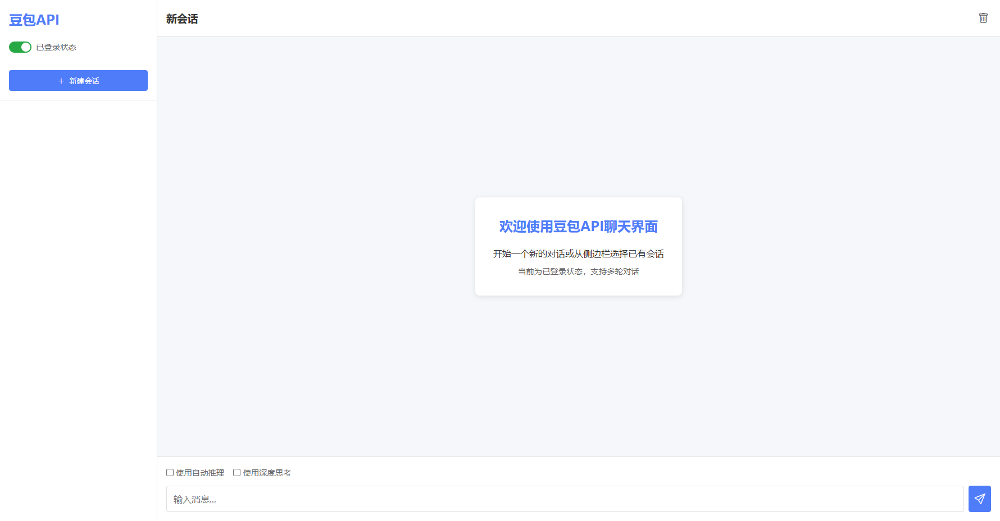
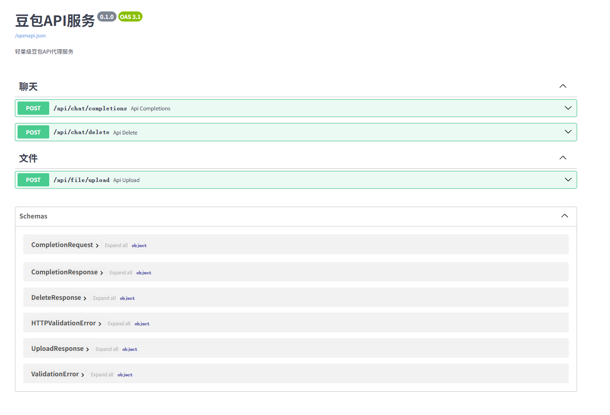

# Doubao Free API

一个轻量级豆包API代理服务

<!-- PROJECT SHIELDS -->

[![Contributors][contributors-shield]][contributors-url]
[![Forks][forks-shield]][forks-url]
[![Stargazers][stars-shield]][stars-url]
[![Issues][issues-shield]][issues-url]
[![MIT License][license-shield]][license-url]

<!-- PROJECT LOGO -->
<br />

<p align="center">
  <a href="https://github.com/XilyFeAAAA/DoubaoFreeApi">
    
  </a>

  <h3 align="center">Doubao Free API</h3>
  <p align="center">
    一个轻量级豆包API代理服务
    <br />
    <a href="https://github.com/XilyFeAAAA/DoubaoFreeApi"><strong>探索本项目的文档 »</strong></a>
    <br />
    <br />
    <a href="https://github.com/XilyFeAAAA/DoubaoFreeApi">查看Demo</a>
    ·
    <a href="https://github.com/XilyFeAAAA/DoubaoFreeApi/issues">报告Bug</a>
    ·
    <a href="https://github.com/XilyFeAAAA/DoubaoFreeApi/issues">提出新特性</a>
  </p>

</p>
 
## 近期更新
1. 获取无水印图片

## TODO

- [ ] 实现未登录状态下携带上下文信息（目前，如果在未登录状态下写到conversation_id，返回500错误）

## 如何抓取豆包配置

要使用本项目，您需要抓取豆包网页版的相关配置信息。以下是抓取方法：
1. 打开浏览器（推荐Chrome或Edge）
2. 访问豆包网页版 [豆包](https://www.doubao.com) 并登录
3. 按F12打开开发者工具，切换到"网络"(Network)选项卡
4. 随意发送一条消息给豆包**Payload**中
5. `tea_uuid`,`device_id`,`web_id`位于请求的Params里, `cookie`和`x_flow_trace`位于请求的**Headers**中, `room_id`位于**浏览器网址**或请求**Headers**的`referer`中

> **注意**: 
> 1. 这些配置信息有时效性，可能需要定期更新。请勿分享您的个人配置信息。
> 2. 如果出现 **rate_limit**的报错，可以尝试在电脑上重新登录豆包，抓取配置文件。

## 上手指南

### 开发前的配置要求

1. Python 3.8+
2. pip 或 uv 包管理工具
3. 豆包平台账号（用于获取API访问凭证）

### 安装步骤

1. 克隆代码库
```sh
git clone https://github.com/XilyFeAAAA/DoubaoFreeApi.git
cd DoubaoFreeApi
```

2. 安装虚拟环境以及依赖
```sh
uv init
uv venv venv
uv pip install -r requirements.txt
```

3. 配置环境变量
```sh
# 复制示例环境变量文件
cp example.session.json session.json
# 编辑 session.json 文件，填入豆包平台的相关凭证
```
> session.json文件存储着全部登录Session，新对话会随机挑选一个Session。
> 游客Session可以在`app.py`中指定生成数量。

1. 启动服务
```sh
uv run app.py
```

服务默认运行在 `http://localhost:8000`，API文档可访问 `http://localhost:8000/docs`

## 项目结构

```
DoubaoFreeApi
├── README.md           # 项目说明文档
├── requirements.txt    # 项目依赖
├── example.session.json# 环境变量示例
├── app.py              # 应用入口
└── /src/               # 源代码目录
    ├── config.py       # 配置管理
    ├── /api/           # API路由
    ├── /model/         # 数据模型
    └── /service/       # 业务逻辑服务
    └── /pool/          # Session 池
```

## 前端界面

目前前端Demo仅仅支持登录和游客状态下对话，不支持上传图片和引用图片。

<p align="center">
  
</p>


## 开发文档

<p align="center">
  
</p>

### API 接口

本项目基于FastAPI框架开发，提供了以下API接口：

1. **聊天接口**

   - **POST** `/api/chat/completions`
     - **功能**：豆包聊天补全接口(目前仅支持文字消息和图片消息)
     - **请求参数**：
       ```json
       {
         "prompt": "用户输入的消息",
         "guest": false,
         "attachments": [
           {
             "key": "文件标识符",
             "name": "文件名称",
             "type": "文件类型",
             "file_review_state": 3,
             "file_parse_state": 3,
             "identifier": "唯一标识符"
           }
         ],
         "conversation_id": "0",  // 新聊天使用"0"
         "section_id": null,       // 新聊天为null
         "use_auto_cot": false,    // 自动选择深度思考
         "use_deep_think": false   // 深度思考
       }
       ```
     - **响应**：
       ```json
       {
         "text": "AI回复内容",
         "img_urls": ["图片URL列表"],
         "conversation_id": "会话ID",
         "messageg_id": "消息ID", 
         "section_id": "段落ID"
       }
       ```
     - **说明**：
       - 如果是新聊天，conversation_id, section_id不填
       - 如果沿用之前的聊天，则使用第一次对话返回的conversation_id和section_id
       - 如果使用游客账号，那么不支持上下文

   - **POST** `/api/chat/delete`
     - **功能**：删除聊天会话
     - **请求参数**：`conversation_id` (Query参数)
     - **响应**：
       ```json
       {
         "ok": true,
         "msg": "成功信息"
       }
       ```
     - **说明**：
       - conversation_id不存在也会提示成功
       - 建议在聊天结束时调用此接口，避免创建过多对话

2. **文件接口**

   - **POST** `/api/file/upload`
     - **功能**：上传图片或文件到豆包服务器
     - **请求参数**：
       - `file_type`: 文件类型 (Query参数)
       - `file_name`: 文件名称 (Query参数)
       - `file_bytes`: 文件二进制内容 (Body)
     - **响应**：
       ```json
       {
         "key": "文件标识符",
         "name": "文件名称",
         "type": "文件类型",
         "file_review_state": 3,
         "file_parse_state": 3,
         "identifier": "唯一标识符",
         "option": {},
         "md5": "文件MD5值",
         "size": 文件大小
       }
       ```
     - **说明**：上传成功后可将返回的信息添加到聊天接口的attachments参数中

详细API文档可在服务启动后访问 `http://localhost:8000/docs` 查看。


## Python示例代码

### 生成文件
```python
async def post(self, url: str, params=None, payload=None, data=None,headers=None) -> dict:
    async with aiohttp.ClientSession() as session:
        async with session.post(url, params=params, json=payload, data=data, headers=headers) as response:
            if response.status == 200:
                return await response.json()
            else:
                error_text = await response.text()
                raise Exception(f"请求失败，状态码: {response.status}: {error_text}")


async def upload_file(self, ftype: int, fname: str, fdata: bytes):
    """上传文件"""
    params = {
        "file_type": ftype,
        "file_name": fname,
    }
    headers = {'Content-Type': 'application/octet-stream'}
    return await self.post(url=f"{self.baseurl}/api/file/upload", params=params, data=fdata, headers=headers)
```

### 对话

```python

async def chat(self, text: str, guest: bool = False, attachments: list=[]):
    payload = {
        "prompt": text,
        "guest": guest
    }
    if self.conversation_id and self.section_id:
        payload["conversation_id"] = self.conversation_id
        payload["section_id"] = self.section_id
    if attachment:
        payload["attachments"] = attachments
    
    resp = await self.post(f"{self.baseurl}/api/chat/completions",payload=payload)
    # 记录conversion_id和section_id实现上下文
    self.conversation_id = resp.get("conversation_id")
    self.section_id = resp.get("section_id")
    
    return resp
```


## 贡献指南

1. 代码风格遵循PEP 8规范
2. 提交PR前请确保代码通过测试
3. 新功能请先创建issue讨论


## 版权说明

该项目签署了MIT 授权许可，详情请参阅 [LICENSE](https://github.com/XilyFeAAAA/DoubaoFreeApi/blob/main/LICENSE)

## 鸣谢


- [Doubao-Image-Proxy](https://github.com/giaoimgiao/Doubao-Image-Proxy)


<!-- links -->
[your-project-path]:https://github.com/XilyFeAAAA/DoubaoFreeApi/blob/main/LICENSE
[contributors-shield]: https://img.shields.io/github/contributors/XilyFeAAAA/DoubaoFreeApi.svg?style=flat-square
[contributors-url]: https://github.com/XilyFeAAAA/DoubaoFreeApi/graphs/contributors
[forks-shield]: https://img.shields.io/github/forks/XilyFeAAAA/DoubaoFreeApi.svg?style=flat-square
[forks-url]: https://github.com/XilyFeAAAA/DoubaoFreeApi/network/members
[stars-shield]: https://img.shields.io/github/stars/XilyFeAAAA/DoubaoFreeApi.svg?style=flat-square
[stars-url]: https://github.com/shaojintian/Best_README_template/stargazers
[issues-shield]: https://img.shields.io/github/issues/XilyFeAAAA/DoubaoFreeApi.svg?style=flat-square
[issues-url]: https://img.shields.io/github/issues/XilyFeAAAA/DoubaoFreeApi.svg
[license-shield]: https://img.shields.io/github/license/XilyFeAAAA/DoubaoFreeApi.svg?style=flat-square
[license-url]: https://github.com/XilyFeAAAA/DoubaoFreeApi/blob/master/LICENSE
